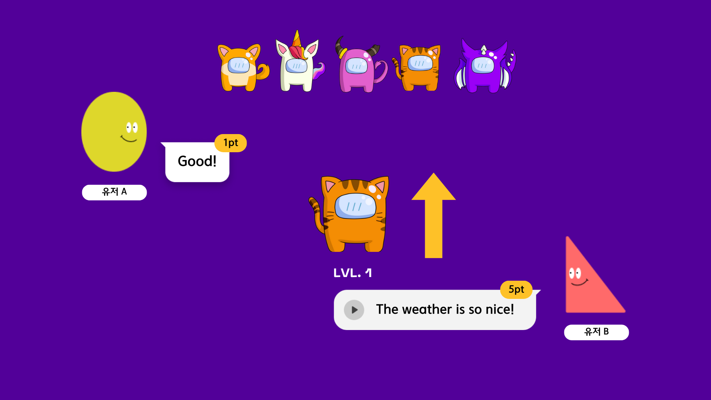

# ✔️ Project: Poppop

  

## 🎤 Poppop 소개

자신을 과하게 꾸며 불특정 다수에게 내세워야 하는 Instagram, Facebook에 질리셨나요?  
친구들과 함께 펫을 키워나가며 소통해요!  
음성 녹음 채팅 기반의 워키토키식 대화, 그리고 성장하는 우리들만의 펫!  
지금 바로 Poppop에서 만나보세요!

  

## 📆 개발 기간

2023.04.10 ~ 2023.05.19

  

## 🔍 주요 기능

1. 모바일 앱으로 워키토키 기능 구현
2. 친구들과 소통하며 Pet 육성

  

## 📃 목차

1. [Poppop 주요 기능](#👀-poppop-주요-기능)
2. [팀원 및 담당 파트](#팀원-및-담당-파트)
3. [기술 스택](#기술-스택)
4. [시스템 아키텍쳐](#시스템-아키텍쳐)
5. [기타 문서](#기타-문서)

  

## 👀 Poppop 주요 기능

#### 회원가입 및 로그인

- App을 깔고 다운로드 후, 한 번도 로그인을 하지 않은 상태라면 국가번호와 번호를 입력하여 로그인
- 해외 문자 인증 서비스를 통해 전세계 문자 인증 서비스 구현
- 알림, 음성, 전화번호부 접근 등 권한 설정 페이지[선택], 프로필 네임 설정[필수], 프로필 사진[선택] 설정으로 구성

 

#### 메인페이지

- 크게 `Chats`, `Contacts`, `More`의 3개의 기본 Page로 구성.

 

#### 채팅방 만들기

- `Create Button`을 누르거나 `Contacts`를 누르면 `Contacts` 페이지로 이동
- `Contacts` 페이지에서 `invite`를 누르면 App을 다운로드하지 않은 사람에게 초대 메세지를 보낼 수 있고, 상대방이 초대 수락을 하기 전까지 `pending` 버튼으로 유지됨
- 상대방이 Poppop의 유저라면 `start` 버튼이 활성화되고, 해당 버튼을 누르면 해당 유저와 채팅을 시작할 수 있음

 

#### 대화하기

- 녹음 버튼을 누르는 동안 음성을 녹음할 수 있고, 손을 떼면 음성 메세지가 전송됨
- 텍스트 입력창을 통해 텍스트 메세지를 보낼 수 있음
- 음성 메세지의 경우, 재생 버튼을 누르면 음성을 들을 수 있음
- bottom tab의 화살표를 누르면 채팅 내역을 볼 수 있는 페이지로 이동함

 

#### pet 키우기

- 상대방이 첫 메세지를 보내면 UFO가 pet으로 바뀌고, pet은 채팅방마다 랜덤으로 생성됨
- pet 성장 조건
  - 텍스트로 메시지 보내기 : 1pt
  - 음성으로 메시지 보내기 : 5pt

 

#### 푸시 알림

- 상대방이 대화방을 개설한 경우, 상대방이 새로운 메세지를 보낸 경우, 대화방 개설 후 상대방이 첫 메세지를 보낸 경우에 푸시 알림이 옴
- header의 종 모양 icon을 누르면 알림 페이지로 이동하고, 읽지 않은 알림이 있는 경우 종 모양 icon에 빨간 점이 생김
- 푸시 알림이나 알림 페이지에서 특정 알림을 누르면 해당하는 채팅방으로 이동

  

## 💻 팀원 및 담당 파트

### Front-end

<table class="tg">
<thead>
  <tr>
    <th class="tg-0pky">팀원</th>
    <th class="tg-0pky">김종혁</th>
    <th class="tg-0pky">김현영</th>
    <th class="tg-0pky">최예린</th>
    <th class="tg-0pky">하진우</th>
  </tr>
</thead>
<tbody>
  <tr>
    <td class="tg-0pky">역할 및 담당 기능</td>
    <td class="tg-0pky">
    - 팀장 
    - Jwt interceptor 설정 
    - 회원관리 
    - 권한 설정(연락처, 마이크)</td>
    <td class="tg-0pky">
    - 연락처 연동 
    - 프로필 수정 및 조회 
    - 채팅방(음성 재생 및 텍스트 채팅)</td>
    <td class="tg-0pky">
    - header 
    - 채팅방 목록 
    - 알림 기능 
    - 권한 설정(알림)</td>
    <td class="tg-0pky">
    - 채팅방(음성 녹음) 
    - 채팅방 목록 
    - S3 저장</td>
  </tr>
</tbody>
</table>

 

### Back-end

<table>
<thead>
  <tr>
    <th class="tg-0pky">팀원</th>
    <th class="tg-0pky">양동기</th>
    <th class="tg-0pky">최성민</th>
  </tr>
</thead>
<tbody>
  <tr>
    <td class="tg-0pky">역할 및 담당 기능</td>
    <td class="tg-0pky">
    - BE 팀장 
    - API 
    - S3 
    - CI/CD</td>
    <td class="tg-0pky">
    - 알림 기능 
    - API</td>
  </tr>
</tbody>
</table>

  

## 📚 기술 스택

#### Front End

#### Back End

#### Infra

## 🔨 시스템 아키텍쳐

  

## ✔️ 기타 문서

### 🎨 ERD

  

### 💡 API 명세서

[API 명세서 링크](https://documenter.getpostman.com/view/27405249/2s93kxd6vL)

  

## 💪 협업툴

- 형상 관리: 
- 이슈 관리: 
- 커뮤니케이션:
  
  
  
- 와이어프레임(UI/UX):
  
